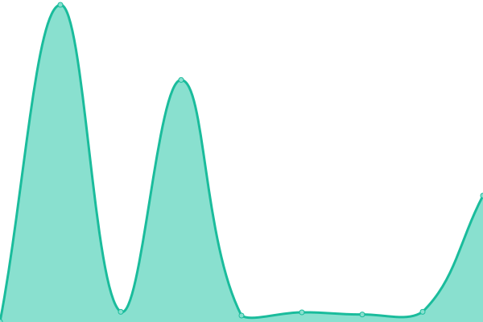
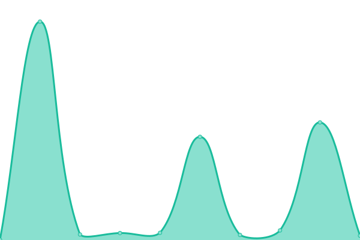
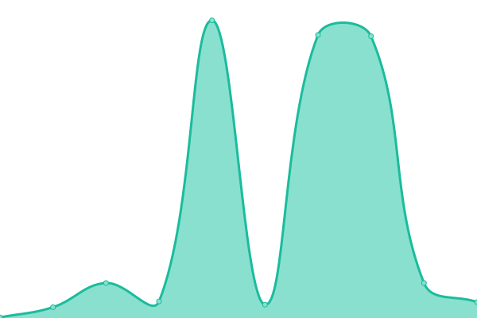
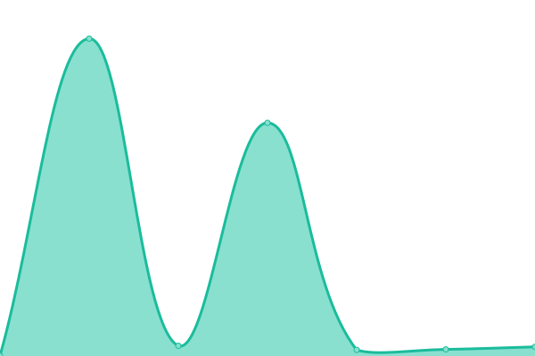
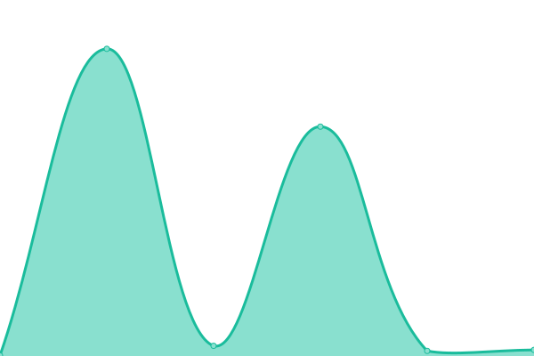

# [📈 Live Status](https://status.lukintosh.com): <!--live status--> **🟧 Partial outage**

This repository contains the open-source uptime monitor and status page for [Lukintosh](https://lukintosh.com), powered by [Upptime](https://github.com/upptime/upptime).

With [Upptime](https://upptime.js.org), you can get your own unlimited and free uptime monitor and status page, powered entirely by a GitHub repository. We use [Issues](https://github.com/LukeMinivaca85/statuss/issues) as incident reports, [Actions](https://github.com/LukeMinivaca85/statuss/actions) as uptime monitors, and [Pages](https://status.lukintosh.com) for the status page.

<!--start: status pages-->
<!-- This summary is generated by Upptime (https://github.com/upptime/upptime) -->
<!-- Do not edit this manually, your changes will be overwritten -->
<!-- prettier-ignore -->
| URL | Status | History | Response Time | Uptime |
| --- | ------ | ------- | ------------- | ------ |
|  [Lukintosh Website](https://lukintosh.com) | 🟥 Down | [lukintosh-website.yml](https://github.com/LukeMinivaca85/statuss/commits/HEAD/history/lukintosh-website.yml) | 

 829ms
     
 | 

<a href="https://status.lukintosh.com/history/lukintosh-website">99.97%</a>
    

|  [Trust Center](https://lukintosh.com/trust.html) | 🟥 Down | [trust-center.yml](https://github.com/LukeMinivaca85/statuss/commits/HEAD/history/trust-center.yml) | 

 1558ms
     
 | 

<a href="https://status.lukintosh.com/history/trust-center">99.98%</a>
    

|  [Security Page](https://lukintosh.com/security.html) | 🟩 Up | [security-page.yml](https://github.com/LukeMinivaca85/statuss/commits/HEAD/history/security-page.yml) | 

 368ms
     
 | 

<a href="https://status.lukintosh.com/history/security-page">100.00%</a>
    

|  [Privacy Policy](https://lukintosh.com/privacy.html) | 🟥 Down | [privacy-policy.yml](https://github.com/LukeMinivaca85/statuss/commits/HEAD/history/privacy-policy.yml) | 

 385ms
     
 | 

<a href="https://status.lukintosh.com/history/privacy-policy">99.98%</a>
    

|  [Terms of Use](https://lukintosh.com/terms.html) | 🟥 Down | [terms-of-use.yml](https://github.com/LukeMinivaca85/statuss/commits/HEAD/history/terms-of-use.yml) | 

 379ms
     
 | 

<a href="https://status.lukintosh.com/history/terms-of-use">99.98%</a>
    

|  [Status Page](https://lukintosh.com/status.html) | 🟥 Down | [status-page.yml](https://github.com/LukeMinivaca85/statuss/commits/HEAD/history/status-page.yml) | 

 388ms
     
 | 

<a href="https://status.lukintosh.com/history/status-page">99.98%</a>
    

|  [security.txt](https://lukintosh.com/.well-known/security.txt) | 🟥 Down | [security-txt.yml](https://github.com/LukeMinivaca85/statuss/commits/HEAD/history/security-txt.yml) | 

 227ms
     
 | 

<a href="https://status.lukintosh.com/history/security-txt">99.98%</a>
    

|  [Accounts](https://accounts.lukintosh.com) | 🟩 Up | [accounts.yml](https://github.com/LukeMinivaca85/statuss/commits/HEAD/history/accounts.yml) | 

 4204ms
     
 | 

<a href="https://status.lukintosh.com/history/accounts">100.00%</a>
    

|  [360 Experience](https://360.inside.lukintosh.com) | 🟩 Up | [360-experience.yml](https://github.com/LukeMinivaca85/statuss/commits/HEAD/history/360-experience.yml) | 

 585ms
     
 | 

<a href="https://status.lukintosh.com/history/360-experience">100.00%</a>
    

<!--end: status pages-->

[**Visit our status website →**](https://status.lukintosh.com)

## 📄 License

- Powered by: [Upptime](https://github.com/upptime/upptime)
- Code: [MIT](./LICENSE) © [Anand Chowdhary](https://anandchowdhary.com), supported by [Pabio](https://pabio.com)
- Data in the `./history` directory: [Open Database License](https://opendatacommons.org/licenses/odbl/1-0/)
